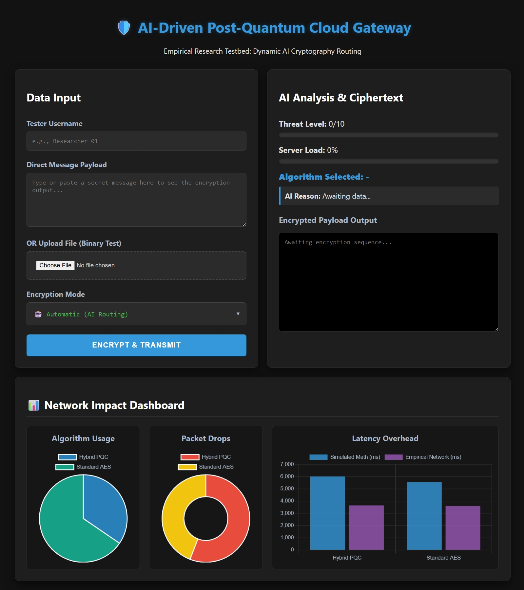
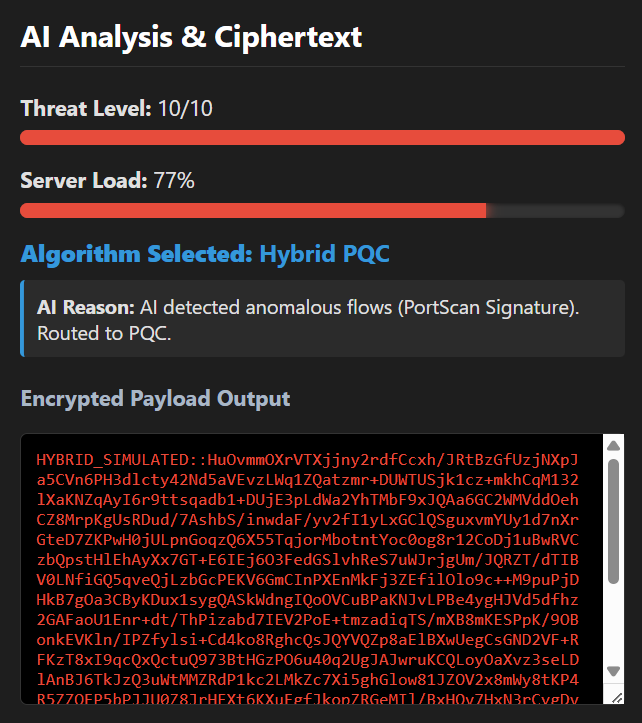

# Smart-PQC-Gateway

Smart-PQC-Gateway is an **AES vs PQC algorithm usage checker** packaged as a small Flask web app.  
It lets you submit a text payload or file, then shows whether the system used **Standard AES** or **Hybrid PQC**, why that route was chosen, and what network impact came with that decision.

> [!NOTE]  
> This repository is mainly calibrated for **Windows Systems**

---

## Repository structure

```text
Smart-PQC-Gateway/
├── code/
│   ├── app.py                 # Flask app and routing logic
│   ├── crypto_engine.py       # AES and hybrid PQC encryption flows
│   ├── network_sim.py         # Simulated latency and packet-loss model
│   ├── test_automator.py      # Bulk upload driver for repeated experiments
│   ├── train_ai.py            # Model training helper
│   ├── templates/index.html   # Web UI
│   └── static/                # CSS and JavaScript assets
├── output/                    # Generated charts/tables/data exports
├── docs/                      # Stores external files
├── LICENSE                    # MIT License
└── readme.md
```

---

## What this project does

The application acts like a research/demo gateway for comparing two cryptographic lanes:

- **Standard AES** for faster, lower-overhead encryption.
- **Hybrid PQC** for heavier, post-quantum-style protection with higher simulated overhead.

Its main job is to help you **check algorithm usage** in three modes:

1. **Automatic mode** – a lightweight AI/routing rule decides whether the payload should go to AES or PQC.
2. **Forced AES mode** – manually verify the AES path.
3. **Forced PQC mode** – manually verify the PQC path.

After each upload, the app reports:

- which algorithm was used,
- the simulated threat level,
- the routing reason,
- ciphertext output,
- estimated latency,
- packet loss, and
- dashboard statistics showing aggregate algorithm usage.

---

## Why this repository exists

This repository is useful if you want to:

- demonstrate the difference between **classical encryption** and **post-quantum-style encryption**
- observe how an application might **switch algorithms based on risk**
- measure the **performance penalty** of PQC-style protection
- test how often AES versus PQC gets selected in repeated runs
- generate sample data for charts, reports, or classroom/research demos

---

## Core workflow

### 1. Submit a payload

You can enter:

- a direct text message
- an uploaded file

### 2. Choose routing behaviour

The UI supports:

- **Automatic (AI Routing)**
- **Standard AES (Forced)**
- **Quantum PQC (Forced)**

### 3. Inspect the decision

The server returns:

- selected algorithm
- threat score
- server load
- routing explanation
- encrypted payload preview

### 4. Review the impact dashboard

The dashboard summarizes:

- **Algorithm Usage**
- **Packet Drops**
- **Latency Overhead**

---

## How algorithm checking works

### Standard AES path

The AES lane uses a Fernet-based symmetric encryption flow for the fast/default classical path.
This path is intended to represent the **lower-latency option**.

### Hybrid PQC path

The PQC lane simulates a hybrid post-quantum workflow by:

- generating an AES key
- encrypting the payload with AES
- adding a **simulated Kyber-style encapsulation overhead**

This provides a practical way to compare **network overhead and routing behaviour** without depending on unstable PQC runtime integrations.

### Automatic routing behaviour

In automatic mode, the server simulates benign versus suspicious conditions and routes traffic accordingly:

- benign traffic → **AES**
- suspicious traffic → **Hybrid PQC**

---

## Features

- **AES vs PQC usage checking** through a browser UI
- **Manual override** to force AES or PQC and validate both paths
- **Automatic routing simulation** for algorithm-selection demos
- **Ciphertext preview** after encryption
- **Latency and packet-loss simulation** for performance comparison
- **Dashboard charts** for aggregate usage and network effects
- **Automation script** for large test batches

---

## Getting started

### Prerequisites

- Python 3.10 recommended
- pip

### Step 1 - Clone the GitHub repository

Select any of the follwing terminals and choose `Run as administrator`:

- `PowerShell`
- `Git Bash`
- `Command Prompt`

Run the following command in the terminal:

```bash
    cd ..
    cd ..
    git clone https://github.com/PrateekRaj8125/Smart-PQC-Gateway
    cd Smart-PQC-Gateway/code
```

### Step 2 - Install dependencies and start the application

Run the following command in your terminal if you are using:

- `PowerShell`
- `Git Bash`

```bash
    ./run_project.bat
```

**OR**  

Run the following command in your terminal if you are using:

- `Command Prompt`
- `JavaSE 1.8 LTS` to `JavaSE 25 LTS`

```bash
    run_project.bat
```

**OR**  

Run the following commands step by step if both of the above commands don't work:

```bash
    pip install -r requirements.txt
    python train_ai.py
    python app.py
```

By default, the Flask server runs at:

```text
    http://127.0.0.1:5000
```



### Step 3 - Open the web interface

1. >**Optional step**

    Go to:

    ```text
        C:\Smart-PQC-Gateway\code
    ```

    Delete `research_data.db` for a fresh database.

2. Visit the local server in your browser and:
    - enter a username
    - paste a message or upload a file
    - choose Automatic, AES, or PQC
    - click **Encrypt & Transmit**

Example:  


### (Optional) Step 4 - Batch experiment check

**Open a new terminal and run:**

```bash
    cd ..
    cd ..
    cd Smart-PQC-Gateway/code
```

1. Download `Clumsy`:

    ```text
        https://github.com/jagt/clumsy
    ```

2. Open the **Clumsy application** and enter the following filter:

    ```text
        tcp.ScrPort==5000 or tcp.DstPort==5000
    ```

    Configure:
    - Lag
    - Drop Rate

3. For repeated trials, run in the second terminal:

    ```bash
        python test_automator.py
    ```

    In the terminal enter the custom `Lag` and custom `Drop` value you set in `Clumsy` application.

4. For repeated trials of High Resolution Images, run in the second terminal:

    ```bash
        python simulate_bulk_photos.py
    ```

    In the terminal enter the custom `Lag` and custom `Drop` value you set in `Clumsy` application.

This sends many uploads to the local server and helps you inspect:

- AES/PQC usage frequency,
- real round-trip time,
- aggregate dashboard changes over time.

### Step 5 - Data Analysis

After experiments are completed:

1. Close the second terminal
2. Switch to the first terminal
3. Run:

    ```bash
        cd ..
        cd output
        python convert_db_to_csv.py
        python generate_output.py
    ```

4. **(Optional)** If you want to see your charts and tables in a python notebook:
    - Open the project `C:\Smart-PQC-Gateway` in an **IDE** like `VS Code`
    - Download appropriate `Jupyter` extension from **Extensions** tab.
    - In the IDE use the shortcut `Ctrl+K` followed by `Ctrl+O` to open the project folder from its destination in C drive.
    - Open the output folder and click on the file named `generate_output.ipynb`.
    - Select Python kernel of your choice. _**Suggestion**:Python 3.13_
    - Click on `Run All` option.

5. Output files are saved in destined folders:
    - Inside folder `C:\Smart-PQC-Gateway\output\tables` all tables are saved.
    - Inside folder `C:\Smart-PQC-Gateway\output\charts` all charts are saved.

---

## Using it as an AES vs PQC checker

### Quick manual check

Use this sequence to validate behaviour:

1. Submit the same short text in **Forced AES** mode.
2. Submit the same text in **Forced PQC** mode.
3. Compare:
    - selected algorithm
    - ciphertext format
    - latency
    - packet loss
    - dashboard usage totals

### Automatic-mode check

To see decision-making behaviour:

1. Select **Automatic (AI Routing)**
2. Run multiple uploads
3. Watch the dashboard split between **Standard AES** and **Hybrid PQC**
4. Review the explanation field to understand why the route was chosen

---

## Interpreting results

### AES selected

→ Lower risk, faster processing

### PQC selected

→ Higher risk, stronger protection

### If PQC looks slower

That is expected in this project.
The simulation intentionally adds overhead so you can clearly observe the trade-off between:

- **speed and efficiency** (AES)
- **stronger post-quantum-style protection** (Hybrid PQC)

---

## Research/demo notes

This repository is best understood as a **simulation and demonstration environment**, not a production-grade cryptographic gateway.

Important notes:

- the PQC flow is a **simulated hybrid model**,
- the automatic route uses a stored model plus controlled logic for demonstrations,
- network effects are intentionally simulated to make AES/PQC differences visible.

---

## License

This project is licensed under the MIT License.

You are free to use, modify, and distribute this software with proper attribution.

See the [LICENSE](https://github.com/PrateekRaj8125/Smart-PQC-Gateway/blob/main/LICENSE) file for full details.

---
